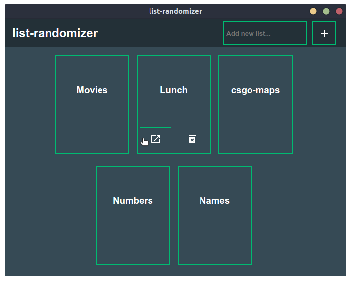
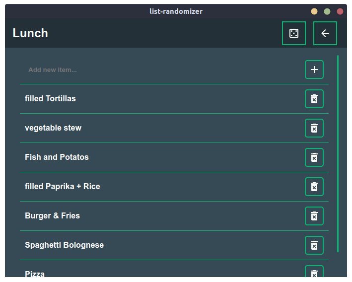

# list-randomizer
Save keywordlists in this nice looking app and get a randomized keyword out of your saved lists, whenever you want. Now you can just let the app decide what too cook for lunch or which of your favourite movies to rewatch in the evening. Programmend in javascript with electron and svelte frameworks.

<p align="center">
  
  
</p>

## features
- cross platform avaliable thanks to electron-framework
  - build on electron and svelte framework
- clean and easy to use user interface
- saving keywordlists in a json database (`electron-db`)
- getting a random keyword out of your list just on a press of a button
  - using the fisher-yates-shuffle as algorithm to get better random efficency

## getting started
At first, please make sure that `node.js` is installed, so that you can use `node` and `npm`.

If `Node.js` is already installed on your system, you can just clone this repository:

```sh
git clone https://github.com/Bj6rn/list-randomizer.git
```

Almost ready, complete these last three steps to use the __list-randomizer__:
- `cd list-randomizer` to get into the app folder
- `npm install` to install the dependencies of the app
- `npm start` to start the __list-randomizer__

You can use `electron-packager` to package the __list-randomizer__ for linux, windows and mac. When packaged you can use the app on systems without Node.js being installed.
- `npm run package-windows` creates a package for windows systems
